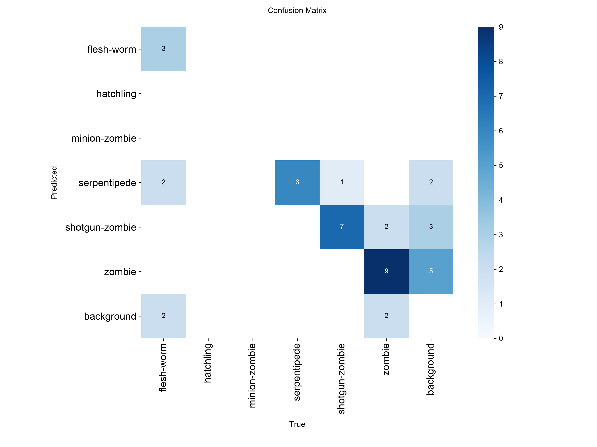
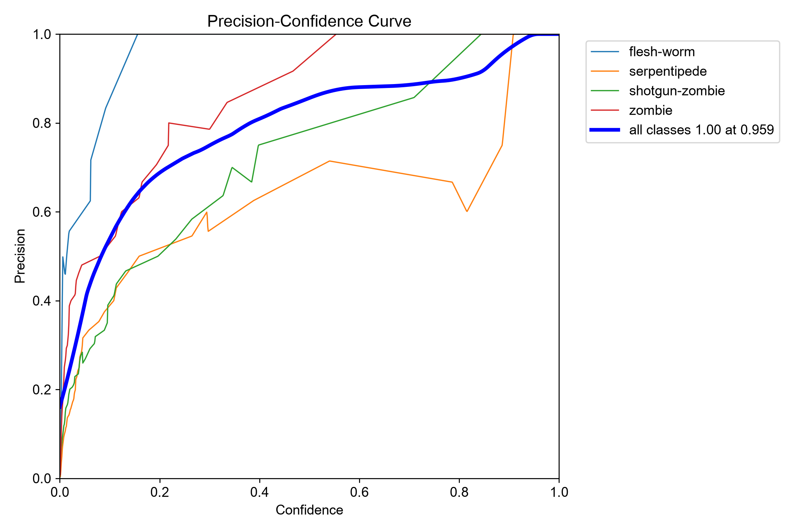
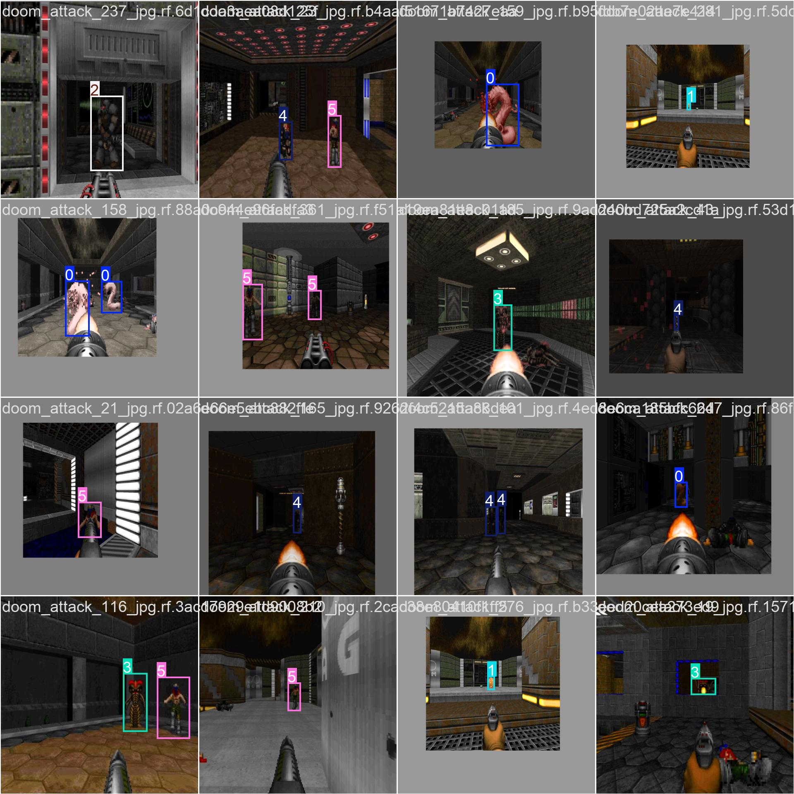

# Objective & Date

*** 

## Allow the model to see:

#### 14 September 2026

Well, in the morning of this day was when I came up with this idea, I googled over [Gymnasium](https://gymnasium.farama.org) about multiple games and I came up with VizDoom but I first had to get familiarized with this API.

In late night I learned that VizDoom allowed you to access to the Memory Buffer but this project wasn't going to be this easy, I thought about using a light YOLO  model to get the box of enemies and adjust the player sight to the enemy.

To train the model I needed a lot of images, that's why I made a [game capture collector](../game_capture_collector.py), at first I thought about recording a whole gameplay, but since this was going to make the data collection more complex because there could be moments with zero action and zero monsters, I made a statement where every time I attacked I would take a capture of the game, and to avoid taking a lot of captures in a second because the game is running on 35 fps the game would only take the capture if the time since the last capture was more than .7 seconds.

##### Training the YOLO model.

Training the YOLO model was probably one of the most boring things I will do in this project, I took almost 1 hour of labeling monsters, at the end I took ~300 captures which was a lot, at least for me.

> [!Note]
> If you have the chance to call a friend to help you with the boxing of the enemies, take it.

To make sure the model did well I trained it on roboflow infrastructure, but hell nah, that's over 60 bucks to export the weights I will do it myself tomorrow.

#### 17 September 2026

Okay today I'm going to be doing the training the YOLO model.

The work is going to be documented at the [YOLO Training Notebook](../YOLOMODEL/YOLO_training.ipynb).
>[!IMPORTANT]
> I used an Apple Silicon Chip to train the model if you're using an Nvidia GPU comment the kwarg **device** on the 3rd code block

Once trained the model the results were the following:

      
      

The model itself is not perfect but will work perfectly fine in our Doom MLG AI.
