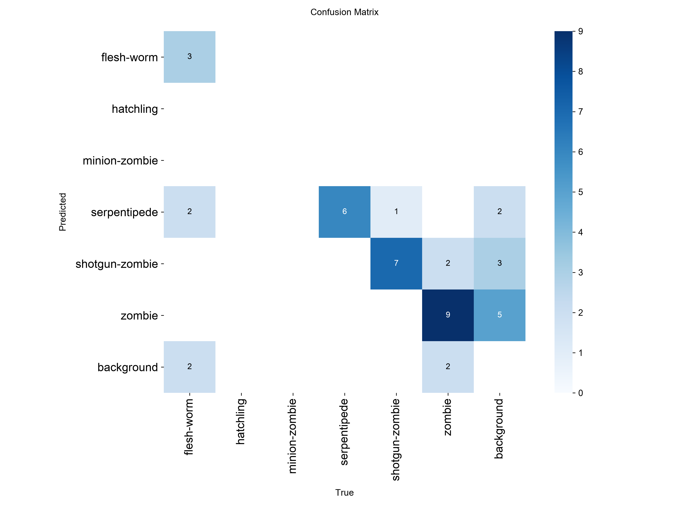
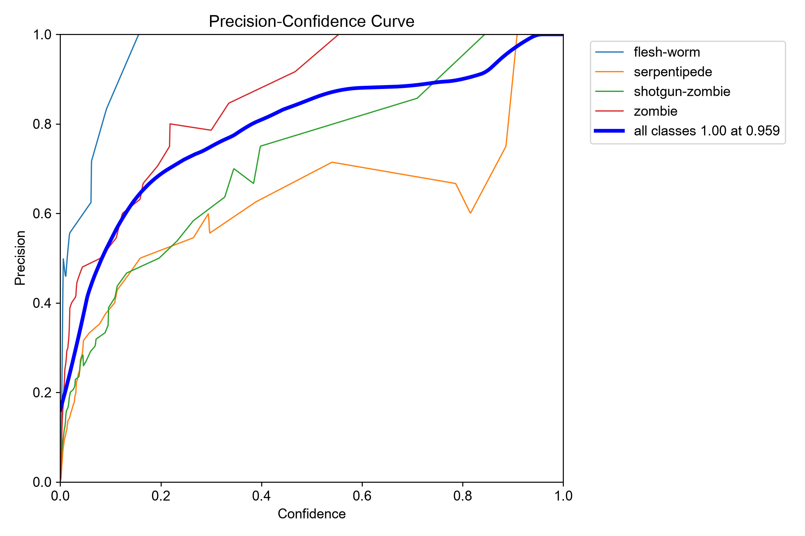
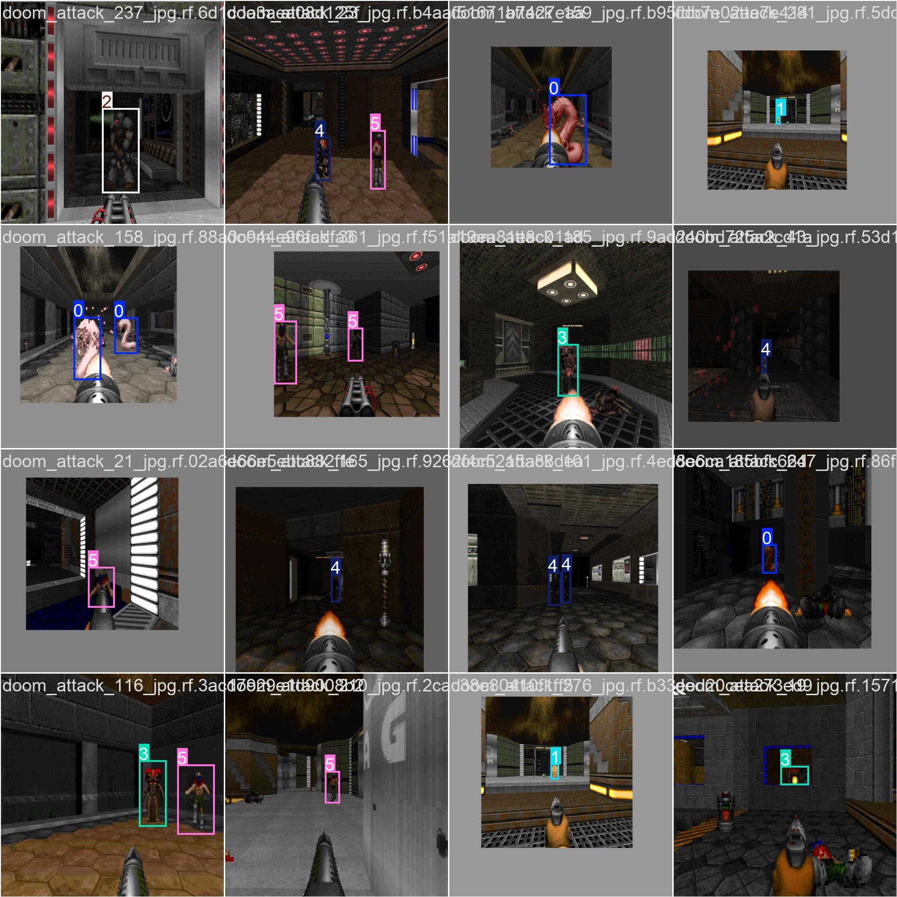

# Objective & Date

*** 

## Allow the model to see:

#### 14 September 2026

Well, in the morning of this day was when I came up with this idea, I googled over [Gymnasium](https://gymnasium.farama.org) about multiple games and I came up with VizDoom but I first had to get familiarized with this API.

In late night I learned that VizDoom allowed you to access to the Memory Buffer but this project wasn't going to be this easy, I thought about using a light YOLO  model to get the box of enemies and adjust the player sight to the enemy.

To train the model I needed a lot of images, that's why I made a [game capture collector](../game_capture_collector.py), at first I thought about recording a whole gameplay, but since this was going to make the data collection more complex because there could be moments with zero action and zero monsters, I made a statement where every time I attacked I would take a capture of the game, and to avoid taking a lot of captures in a second because the game is running on 35 fps the game would only take the capture if the time since the last capture was more than .7 seconds.

##### Training the YOLO model.

Training the YOLO model was probably one of the most boring things I will do in this project, I took almost 1 hour of labeling monsters, at the end I took ~300 captures which was a lot, at least for me.

> [!Note]
> If you have the chance to call a friend to help you with the boxing of the enemies, take it.

To make sure the model did well I trained it on roboflow infrastructure, but hell nah, that's over 60 bucks to export the weights I will do it myself tomorrow.

#### 17 September 2026

Okay today I'm going to be doing the training the YOLO model.

The work is going to be documented at the [YOLO Training Notebook](../YOLOMODEL/YOLO_training.ipynb).
>[!IMPORTANT]
> I used an Apple Silicon Chip to train the model if you're using an Nvidia GPU comment the kwarg **device** on the 3rd code block

Once trained the model the results were the following:

      
      

The model itself is not perfect but will work perfectly fine in our Doom MLG AI.

#### 23 September 2026

##### It's been a while, this day was meant to know how was the model prediction doing and then implement the aimbot.

My reasoning was the following, YOLO predictions will provide a box, but it's not an explicit box, to draw a box is necesary only to know 2 points, x1 & y1, which is going to be a corner, and x2 & y2 which is going to be the diagonal corner, with this, we will know where the enemy is located.

More importantly, in Doom you can't look upwards, just sideways, so to hit a target it's only necessary that the monster is at the middle of your screen, doom will consider for you the vertical shooting.
While thinking about the case of having multiple enemies at a time in the screen, I thought about multiple solutions and finally decided the best approach, honestly, the model can miss classify, this miss classification are more prone to happen if the object is further away from the screen, so I will define a variable that collects the biggest box and a little smoothing factor that will also consider how far is the enemy from the middle of the screen.

The formula will be the following:

$$ BoxArea = |x_1 - x_2| * |y_1 - y_2|$$

$$ Score = max( rectangleArea / ( distance + smoothingFactor )) $$

Simple, isn't?

---
After reading carefully the documentation, Vizdom uses a FOV (Field Of View) of 90°.
#### What does this mean?

Imagine you have a screen of 90px * 1px and a FOV of 90°, this means, each pixel represents a grade, if you're looking at the 1st pixel and you want to look at the 5th pixel, you hace to move your camera 4 grades, this will be escalated to the resolution we're using.

In this case we're using a resolution of 640 * 480 and the proportion of grades per pixel is going to be only the division of the FOV between the width.

##### Results of the day:

On god, the model works perfectly fine, there's just one problem, Vizdoom only allows you to make actions if you're in the Mode : Player, sadly the movement is very bad if you do it based on key inputs, but the model is able to track the enemy with almost milimetrical accuracy.

And there's this one error where the model detects the face of the marine as a Hatcling, I'll take care of this later.
    

